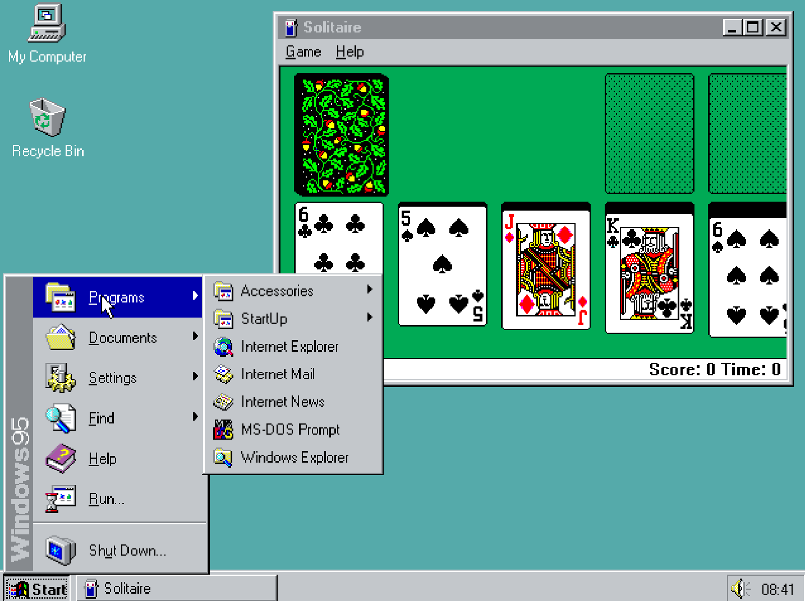

***

# Design reference for Windows 95 (Minecraft world)

Here is the design reference file for my Windows 95 Minecraft world.

Desktop:

[Click here to view the image (windows-95-100642545-slide.png)](windows-95-100642545-slide.png)

Keyboard:

[Click here to view the image (KB_United_States.svg)](KB_United_States.svg)

No other design references as of Wednesday, January 27th 2021 at 5:23 pm

***

## File info

File type: `Markdown (*.md)`

File version: `2 (Wednesday, January 27th 2021 at 5:23 pm)`

Line count (including blank lines and compiler line): `89`

***

## File history

Version 1 (Monday, January 25th 2021 at 2:32 pm)

> Changes:

> * Started the file

> * Added a design reference for the Windows 95 desktop UI

> * Added the file info section

> * Added the file history section

> * Added the footer

> * No other changes in version 1

Version 2 (Wednesday, January 27th 2021 at 5:23 pm)

> Changes:

> * Added a reference keyboard image

> * Updated the file info section

> * Updated the file history section

> * No other changes in version 2

Version 3 (Coming soon)

> Changes:

> * Coming soon

> * No other changes in version 3

Version 4 (Coming soon)

> Changes:

> * Coming soon

> * No other changes in version 4

***

## Footer

You have reached the end of this file!

### EOF

***
